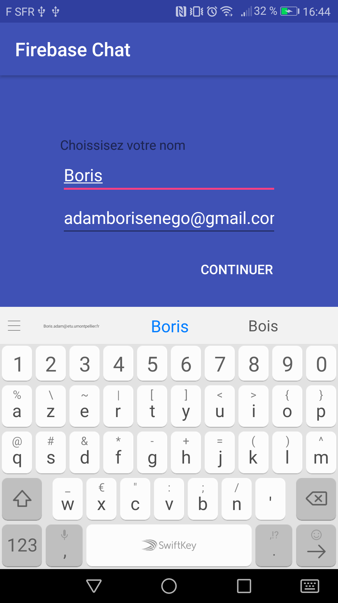
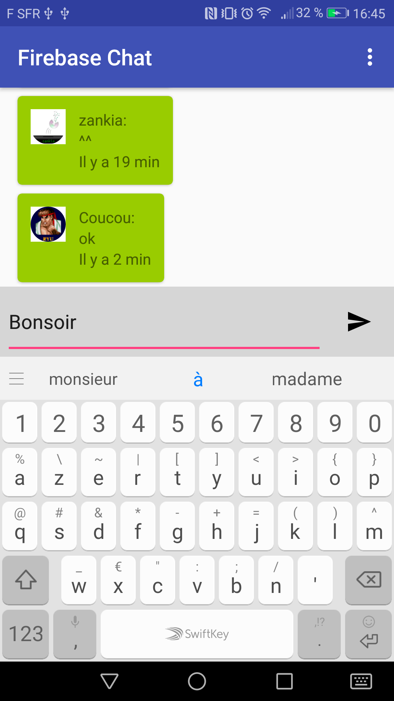
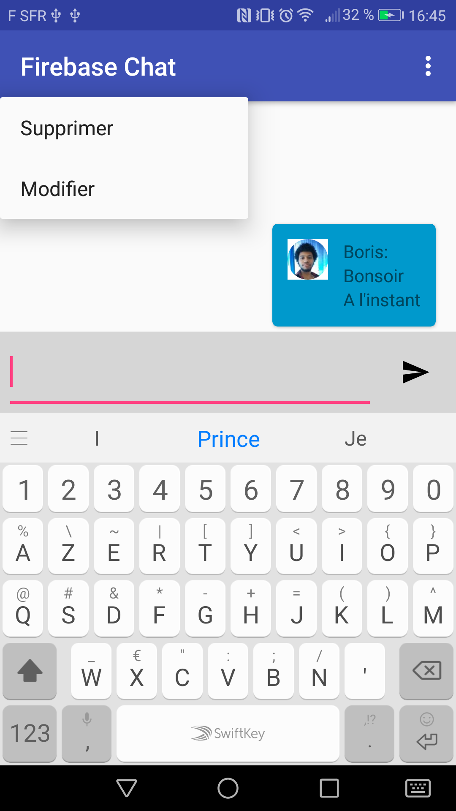
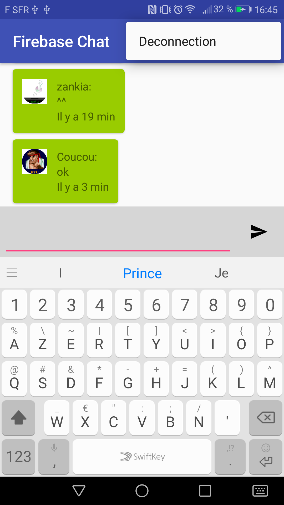

# project_android_adamboris
Application de communication utilisant firebase:

Fonction disponible:
- Envoyer des messages et lire des messages sur un groupe de communication, la suppression et la modification des messages est possible.
- Les messages envoyé par l'utilisateur sont affiché à droite, alors que les messages reçut sont affiché à gauche.
- Possibilité de se connecter avec une adresse mail ( et de se deconnecter), en appuyant sur le bouton deconnection en haut à droite.
- La date d'envoi des messages est calculé et affiché en dessous du message en question.
- Suivant la langue utilisée par le téléphone l'application sera traduite en anglais ou en français.

Utilisation de l'application:

